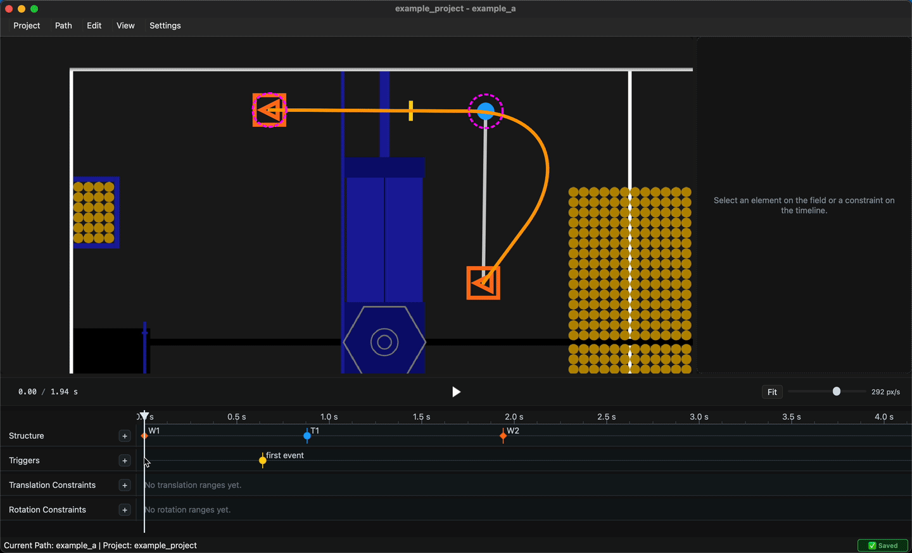

# BUI

BUI is a timeline-based fork of [BLine-GUI](https://github.com/edanliahovetsky/BLine-GUI), the desktop editor for creating BLine autonomous paths for holonomic FRC drivetrains.

BUI is designed to be fully compatible with the files [BLine-Lib](https://github.com/edanliahovetsky/BLine-Lib) expects. You can switch to BUI from BLine-GUI immediately for any BLine codebase.

The field canvas remains the geometric editor, the right sidebar remains the detailed inspector, and the bottom timeline is the main surface for sequence, timing, event triggers, playback, scrubbing, and ranged constraints.

📚 **[Original BLine Documentation](https://edanliahovetsky.github.io/BLine-Docs/)** — path concepts, robot-side usage, and reference.

☕ **[BLine-Lib](https://github.com/edanliahovetsky/BLine-Lib)** — the BLine Java library.




## Timeline Workflow

BUI keeps BLine-GUI's canvas editor and adds a video-editor-style timeline:

- Three-region layout: field canvas, property sidebar, and full-width bottom timeline.
- Playback and scrubbing live in the timeline.
- Time-based axis with zoom, scrolling, and fit-to-view.
- Path structure, event triggers, and ranged constraints are visible in sequence.
- Event triggers and ranged constraints can be edited directly from the timeline.
- Selection sync between the canvas, timeline, and sidebar.

## Installation

### Prebuilt Binaries

Download the latest release for your platform from the
[**Releases page**](https://github.com/jamespeilunli/BUI/releases/latest).

### From Source

This repo uses Python 3.11+ and PySide6.

```bash
git clone https://github.com/jamespeilunli/BUI.git
cd BUI
uv sync
uv run main.py
```

### As a Python Package

When installed as a package, the application entry point is `bui`:

```bash
uv tool install git+https://github.com/jamespeilunli/BUI.git
bui
```

To create a desktop shortcut after package installation:

```bash
bui --create-shortcut
```

## Quick Start

1. Launch `bui` or run `uv run main.py` from the repo.
2. Open an FRC project or autos project directory.
3. Edit path geometry on the field canvas.
4. Use the bottom timeline to inspect path order, scrub playback, place triggers, and edit ranged
   constraints.
5. Use the right sidebar for exact values and detailed properties.

## Development

Common commands:

```bash
uv sync
uv run main.py
uv run ruff format
uv run ruff check
uv run mypy
uv run pytest
```

The required test command for this repo is:

```bash
uv run pytest
```

Read `AGENTS.md` before making changes.

## Project Layout

- `main.py` - Application entry point and BUI app identity.
- `models/` - Path data structures, ordinal remapping, and simulation helpers.
- `ui/canvas/` - Field canvas and geometry editing.
- `ui/timeline/` - Timeline dock, projection, transport, editing, zoom, and track rendering.
- `ui/sidebar/` - Property inspector and exact-value controls.
- `ui/main_window/` - Three-region shell, menus, autosave, undo/redo, and cross-region wiring.
- `utils/` - Project persistence, path/config IO, settings, and undo commands.
- `docs/` - Design principles, architecture context, and upstream sync notes.
- `tests/` - Unit and integration tests for model, IO, timeline, sidebar, canvas, and main-window behavior.
- `packaging/` - Build scripts and PyInstaller/Inno/AppImage packaging files.

## License

BSD 3-Clause License. See [LICENSE](LICENSE).
